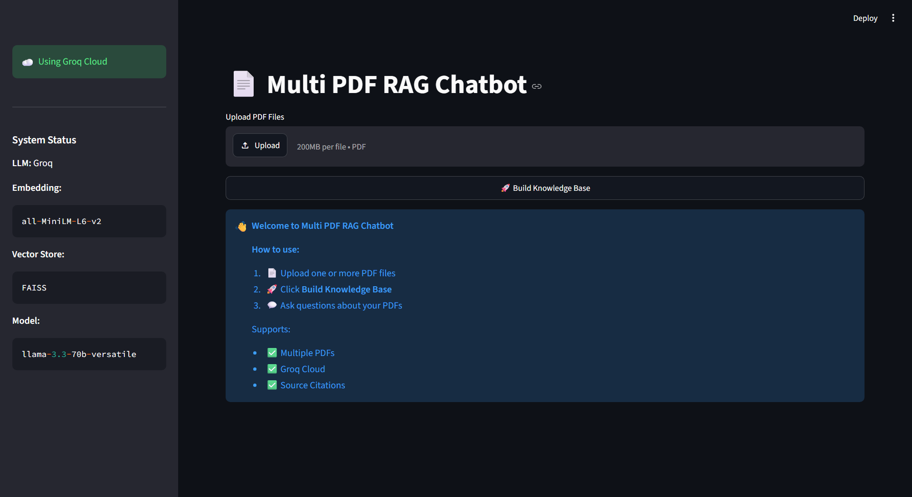
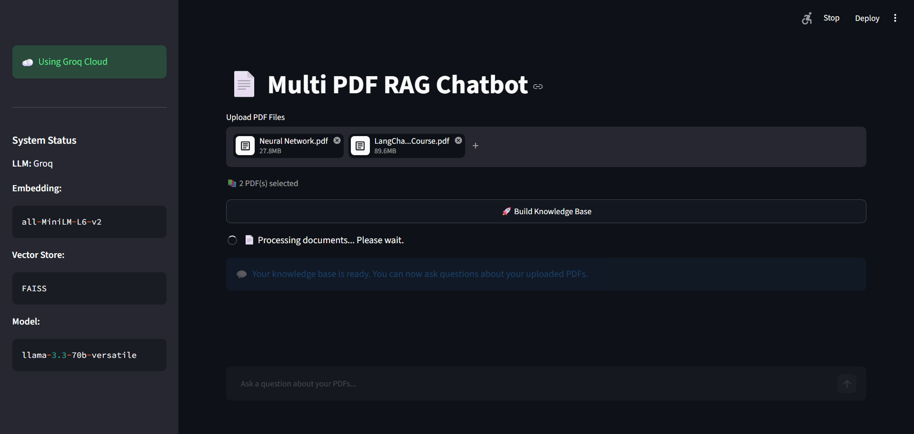
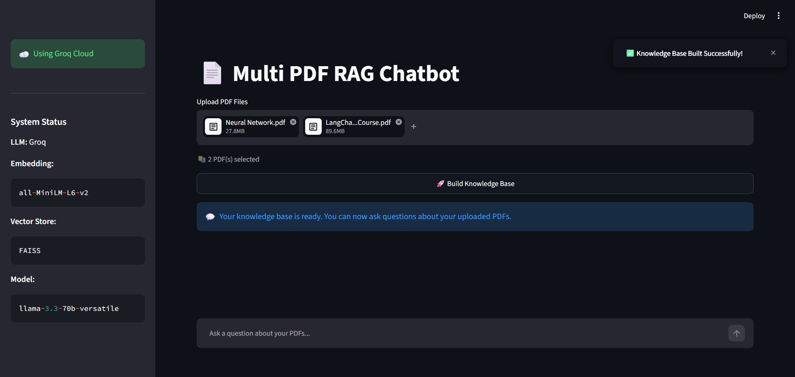
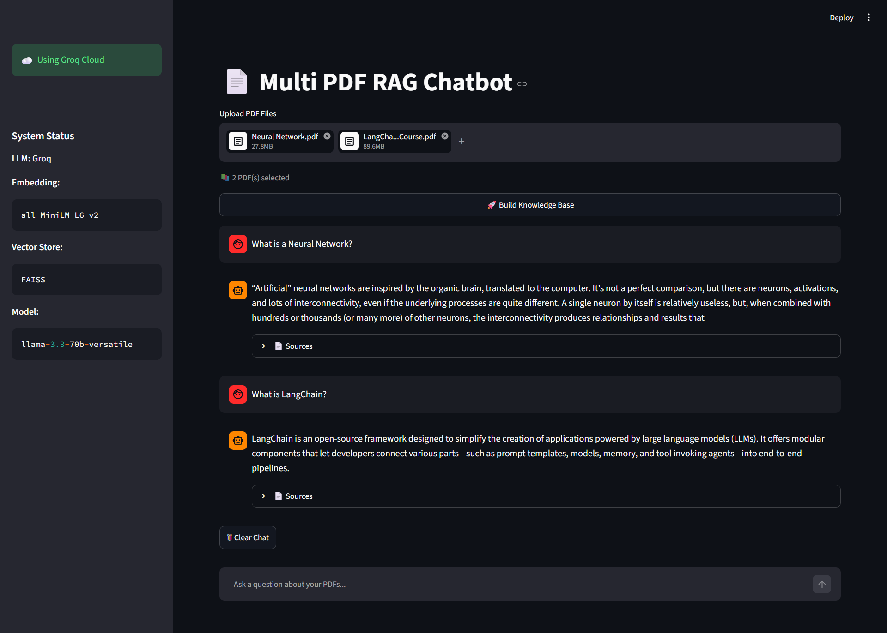
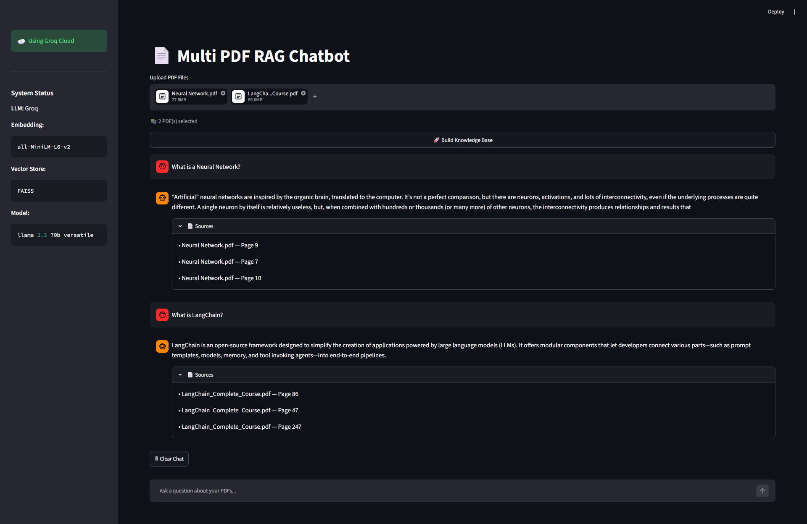

# 📄 Multi PDF RAG Chatbot


A Retrieval-Augmented Generation (RAG) chatbot built with **LangChain**, **FAISS**, **Groq**, and **Streamlit** that allows users to upload multiple PDF documents and ask context-aware questions with source citations.

The application retrieves relevant information from uploaded PDFs using semantic search and generates accurate responses with source citations.

## 🚀 Live Demo

👉 **[Try the Live Application](https://multi-pdf-rag-chatbot-web-application.streamlit.app/)**

_No installation required. Open the app directly in your browser._

## ✨ Features

- 📄 Upload and chat with multiple PDF documents
- 🔍 Semantic search using FAISS Vector Store
- 🤖 AI-powered responses using Groq LLM
- 🧠 HuggingFace Sentence Transformers for embeddings
- 📚 Source citations with PDF name and page number
- 💬 Interactive chat interface built with Streamlit
- ⚡ Fast document retrieval using LangChain RAG pipeline
- 🗂️ Modular and maintainable project structure

## 🛠️ Tech Stack

| Category | Technology |
|----------|------------|
| Language | Python |
| Framework | Streamlit |
| LLM | Groq (llama-3.3-70B-versatile)        |
| Framework | LangChain |
| Embedding Model | sentence-transformers/all-MiniLM-L6-v2 |
| Vector Store | FAISS |
| PDF Loader | PyPDF |

## 📂 Project Structure

```text
Multi_PDF_RAG_Chatbot/
│
├── app.py                     # Streamlit application
├── requirements.txt
├── .gitignore
├── README.md
│
├── chains/
│   └── rag_chain.py
│
├── config/
│   └── settings.py
│
├── embeddings/
│   └── embedding_model.py
│
├── loaders/
│   └── pdf_loader.py
│
├── models/
│   └── groq_llm.py
│
├── prompts/
│   └── prompt_template.py
│
├── retrievers/
│   └── retriever.py
│
├── text_splitter/
│   └── text_splitter.py
│
├── utils/
│   └── helper.py
│
├── vectorstore/
│   └── faiss_store.py
│
└── screenshots/
```

## ⚙️ Installation

### Requirements

- Python 3.10 or above

### 1. Clone the repository

```bash
git clone https://github.com/vaibhavsachdeva16/Multi-PDF-RAG-Chatbot.git

cd Multi-PDF-RAG-Chatbot
```

### 2. Create a virtual environment

**Windows**

```bash
python -m venv VirtualEnvironment

VirtualEnvironment\Scripts\activate
```

### 3. Install dependencies

```bash
pip install -r requirements.txt
```

## 🔑 Groq API Setup

This project uses the **Groq Cloud API** for generating responses.

### 1. Create a free Groq account

Visit the **[Groq Console](https://console.groq.com/)** to create a free API key.

### 2. Create a `.env` file

Create a `.env` file in the project root directory.

```env
GROQ_API_KEY=your_groq_api_key
```

## ▶️ Run the Application

Start the Streamlit application:

```bash
streamlit run app.py
```

The application will open in your default browser.

## 🚀 Usage

1. Upload one or more PDF documents.
2. Click **Build Knowledge Base**.
3. Wait for the knowledge base to be created.
4. Ask questions related to your uploaded PDFs.
5. View the generated answer along with source citations.

## 📸 Screenshots

### Home Page



### Upload PDF



### Knowledge Base Ready



### Chat Interface



### Source Citations



## 🔮 Future Improvements

- 🌐 Support for additional LLM providers (OpenAI, Gemini, Ollama)
- 📂 Support for DOCX and TXT documents
- 💾 Persistent chat history
- 📝 Export conversations (PDF / TXT)
- 📊 Streaming responses
- 🔍 Hybrid Search (BM25 + Vector Search)

## 👨‍💻 Author

## 👨‍💻 Author

**Vaibhav Sachdeva**

GitHub: https://github.com/vaibhavsachdeva16

LinkedIn: https://www.linkedin.com/in/vaibhavsachdeva7

## ⭐ Support

If you found this project helpful, consider giving it a ⭐ on GitHub.

Contributions, suggestions, and feedback are always welcome.